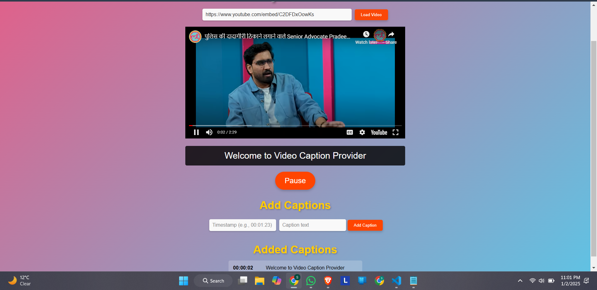

# Video Caption Provider

It is a React web application that allows users to add captions to a video, synchronize captions with specific mentioned timestamps, and view the captions displayed in real-time below the video.
---

## **App ScreenShot**



## **Features**
- **Load Video:** Add a video URL (from Youtube or other Source) to load and play the video.
- **Add Captions:** Input captions with corresponding timestamps to synchronize with the video.
- **Display Captions:** View captions displayed below the video as the video plays.
- **Interactive Controls:** Use play/pause buttons for seamless video control.
- **Caption List:** View added captions in a table-like format.
- **Responsive Design:** Works across various screen sizes with a modern gradient background.

---

## **Technologies Used**
- **Frontend Framework:** React.js
- **Styling:** CSS
- **Video Integration:** YouTube IFrame API

---

## **How to Run the Project**

### **Prerequisites**
- Node.js
- npm


---

### **Steps to Run**
1. **Clone the Repository**  
   Open a terminal and run:  
   ```bash
   git clone https://github.com/SUSAJJIT/Video_Caption_Provider.git
   ```
2. **Navigate to the Project Directory**
   
   ```bash
   cd video-caption-provider
   ```

3. **Run following Commands**
    
     ```bash
    npm install
    
    npm start
   
   ```
4. **Access the Application & Use**

- Visit : http://localhost:3000
- Input Video URL from Youtube or other Source
- Click On "Load Video" button
- Add Time Stamp and Caption using given respective input fields and click on " Add Caption"
- Play the video and Captions will be displayed at mentioned Time stamp.


  
